<div align="center">

# Student Portal — AWS ECS Fullstack Deployment

**Production-grade three-tier application deployed on AWS ECS Fargate with full GitOps CI/CD**

[](https://aws.amazon.com/ecs/)
[](https://openjdk.org/)
[](https://spring.io/projects/spring-boot)
[](https://react.dev/)
[](https://www.mysql.com/)
[](https://github.com/features/actions)

<br/>

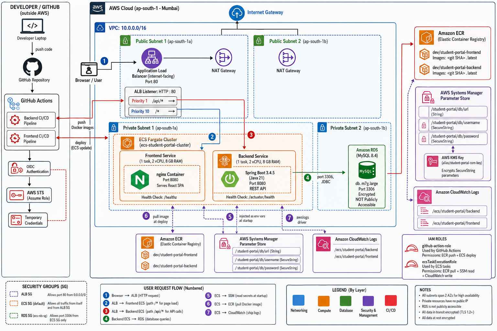

</div>

---

## Table of Contents

1. [Overview](#1-overview)
2. [Tech Stack](#2-tech-stack)
3. [Application Preview](#3-application-preview)
4. [High-Level System Architecture](#4-high-level-system-architecture)
5. [VPC & Network Topology](#5-vpc--network-topology)
6. [AWS Service Components](#6-aws-service-components)
7. [Request Lifecycle](#7-request-lifecycle)
8. [Container Build Strategy](#8-container-build-strategy)
9. [CI/CD Pipeline](#9-cicd-pipeline)
10. [IAM & Security](#10-iam--security)
11. [Local Development](#11-local-development)
12. [API Reference](#12-api-reference)
13. [Project Structure](#13-project-structure)

---

## 1. Overview

This repository contains a **Student Portal** — a CRUD application that demonstrates the deployment of a modern three-tier system on AWS using **infrastructure-as-code-friendly patterns**, **automated CI/CD**, and **production security best practices**.

**Key Highlights:**

- Containerized with multi-stage Docker builds (non-root users, CVE-patched base images)
- Deployed on **AWS ECS Fargate** (serverless containers, no EC2 management)
- Single **Application Load Balancer** with **path-based routing** for both frontend and backend
- **Private RDS MySQL** instance accessible only from within the VPC
- **Secrets management** via AWS SSM Parameter Store (no credentials in code or images)
- **GitHub Actions CI/CD** with **OIDC authentication** (zero long-lived AWS keys)
- **Automated deployments** with rolling updates and circuit-breaker rollback

---

## 2. Tech Stack

| Layer | Technology | Version |
|:------|:-----------|:--------|
| **Frontend** | React + TypeScript + Vite | 19 / 5.7 / 6 |
| **Frontend Server** | nginx (Alpine) | 1.27 |
| **Backend** | Spring Boot + Java | 3.4.5 / 21 |
| **Database** | MySQL on Amazon RDS | 8.4 |
| **Container Runtime** | AWS Fargate | Latest |
| **Container Registry** | Amazon ECR | — |
| **Load Balancer** | Application Load Balancer | — |
| **Secrets** | AWS SSM Parameter Store | — |
| **CI/CD** | GitHub Actions + OIDC | — |
| **Monitoring** | CloudWatch Logs | — |

---

## 3. Application Preview

<table>
<tr>
<td width="50%" align="center">

<br/>
<sub><b>Student List</b> — paginated table with search and avatar initials</sub>
</td>
<td width="50%" align="center">

<br/>
<sub><b>Student Form</b> — validated create/edit form with RFC 7807 error handling</sub>
</td>
</tr>
</table>

---

## 4. High-Level System Architecture

The application follows a **classic three-tier architecture** deployed entirely within a custom AWS VPC. All inbound traffic flows through a single ALB which routes to ECS Fargate tasks based on URL path.

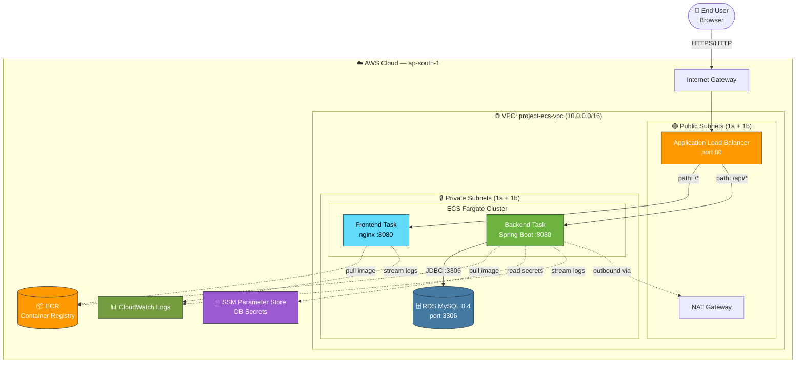

> **Reference image:** 

---

## 5. VPC & Network Topology

The VPC is divided into **public and private subnets across two availability zones** for high availability. Only the load balancer is exposed to the internet; all compute and data resources live in private subnets.

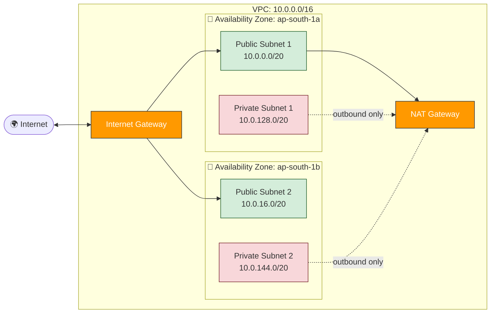

### Resource Placement

| Resource | Subnet Type | Reason |
|:---------|:------------|:-------|
| Application Load Balancer | Public | Must accept internet traffic |
| NAT Gateway | Public | Provides outbound internet to private subnets |
| ECS Fargate Tasks | Private | No direct internet access — secure by default |
| RDS MySQL | Private | Database must never be publicly reachable |

### Security Groups

| Security Group | Direction | Port | Source / Destination | Purpose |
|:---------------|:---------:|:----:|:--------------------|:--------|
| **ALB SG** | Inbound | 80 | `0.0.0.0/0` | Allow HTTP from internet |
| **ECS Task SG** | Inbound | 8080 | ALB SG | Allow traffic only from ALB |
| **RDS SG** (`ecs-rds-sg`) | Inbound | 3306 | ECS Task SG | Allow DB connections from ECS only |

---

## 6. AWS Service Components

### 6.1 Application Load Balancer


The ALB acts as the **single front door** for all incoming traffic. It performs:
- TLS termination (when HTTPS certificate is added)
- Path-based routing
- Health checks on backend tasks
- Cross-zone load balancing

#### Listener Rules


| Priority | Path Pattern | Target Group | Purpose |
|:--------:|:-------------|:-------------|:--------|
| **1** | `/api/*` | `student-portal-backend-tg` | Route API requests to Spring Boot |
| **10** | `/*` | `student-portal-frontend-tg` | Route everything else to React SPA |
| **Default** | (any) | `student-portal-backend-tg` | Catch-all fallback |

#### Target Groups

| Target Group | Port | Protocol | Health Check Path | Healthy Threshold |
|:-------------|:----:|:--------:|:------------------|:-----------------:|
| `student-portal-backend-tg` | 8080 | HTTP | `/actuator/health` | 2 |
| `student-portal-frontend-tg` | 8080 | HTTP | `/healthz` | 2 |


---

### 6.2 ECS Fargate Cluster


| Property | Value |
|:---------|:------|
| **Cluster Name** | `ecs-student-protal-cluster` |
| **Launch Type** | AWS Fargate (serverless) |
| **Network Mode** | `awsvpc` (each task gets its own ENI) |
| **Operating System** | Linux X86_64 |

#### Services

| Service | Task Definition | Desired Tasks | CPU | Memory | Health Check Grace |
|:--------|:----------------|:-------------:|:---:|:------:|:------------------:|
| `backend-service` | `backend` | 1 | 2 vCPU | 8 GB | 90s |
| `frontend-service` | `frontend` | 1 | 2 vCPU | 8 GB | 30s |

#### Task Definition Anatomy


Each task definition declares:
- **Container image** — pulled from ECR at task start
- **Port mappings** — exposes `8080` on the task ENI
- **Secrets** — `valueFrom` references to SSM parameters (injected as env vars)
- **Log configuration** — streams `stdout`/`stderr` to CloudWatch via `awslogs` driver
- **IAM execution role** — grants ECS agent permission to pull image & read secrets

---

### 6.3 Amazon ECR (Elastic Container Registry)


Two **private** container repositories store immutable images per commit:

| Repository | Contents | Tags |
|:-----------|:---------|:-----|
| `dev/student-portal-backend` | Spring Boot layered JAR | `<8-char-sha>` + `latest` |
| `dev/student-portal-frontend` | React build + nginx | `<8-char-sha>` + `latest` |

**Tagging strategy:**
- `latest` → most recent successful build from `main` branch
- `<git-sha>` → immutable reference for full traceability and rollbacks

---

### 6.4 Amazon RDS (MySQL)


| Property | Value |
|:---------|:------|
| **Engine** | MySQL 8.4 Community |
| **Instance Class** | `db.m7g.large` (2 vCPU, 8 GB RAM) |
| **Storage** | 20 GiB gp3 (auto-scaling to 1 TB) |
| **Subnet Placement** | Private subnets only |
| **Public Accessibility** | ❌ Disabled |
| **Encryption at Rest** | ✅ AWS managed KMS |
| **Master Username** | `admin` (stored in SSM) |

**Database lifecycle:**
- Schema is managed by **Flyway migrations** in `backend/src/main/resources/db/migration/`
- Migrations run **automatically on Spring Boot startup**
- JPA is configured with `ddl-auto: validate` — Hibernate can never silently modify the schema

---

### 6.5 AWS SSM Parameter Store


All sensitive configuration is centralized in SSM and **injected into the container at task startup** by the ECS agent — never embedded in code or images.

| Parameter Name | Type | Injected As (env var) |
|:---------------|:----:|:----------------------|
| `/student-portal/db/url` | `String` | `DB_URL` |
| `/student-portal/db/username` | `SecureString` | `DB_USERNAME` |
| `/student-portal/db/password` | `SecureString` | `DB_PASSWORD` |

`SecureString` parameters are encrypted with the AWS-managed KMS key `alias/aws/ssm`. The `ecsTaskExecutionRole` is granted `ssm:GetParameters` + `kms:Decrypt` to read them at startup.

---

## 7. Request Lifecycle

### 7.1 Page Load (Browser → Frontend)

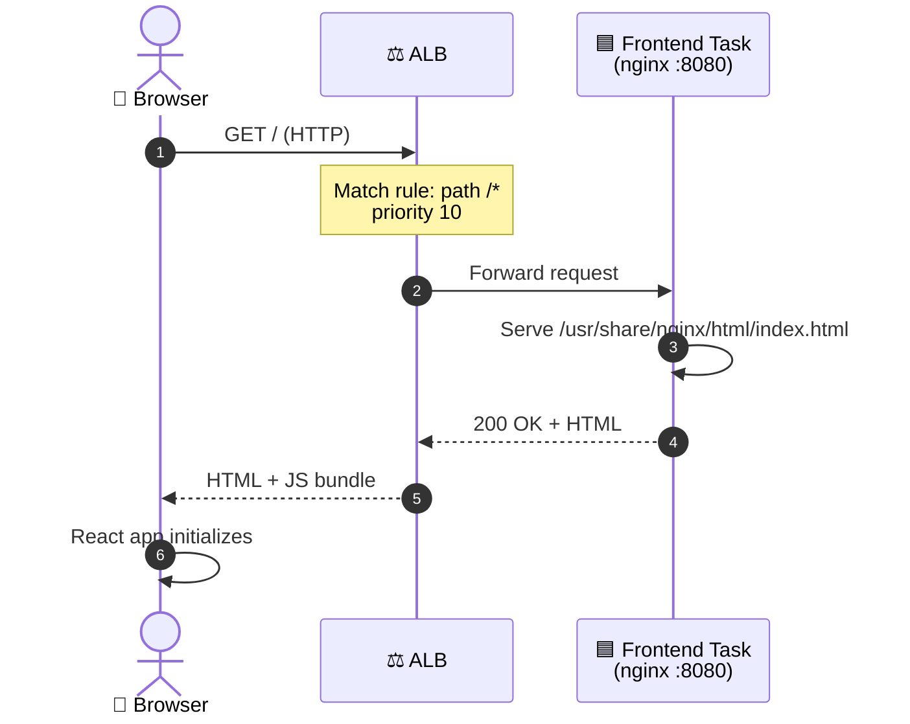

### 7.2 API Call (Browser → Backend → Database)

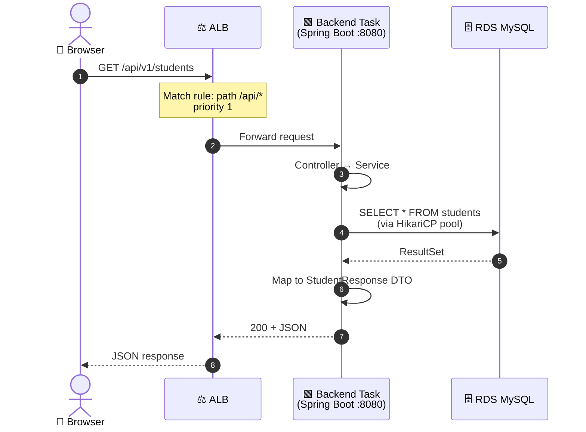

### 7.3 ECS Task Startup

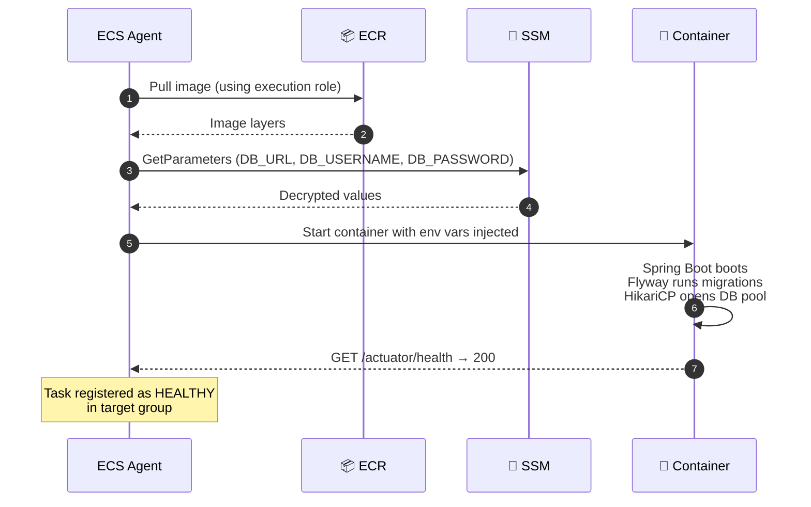

---

## 8. Container Build Strategy

Both Dockerfiles use **multi-stage builds** to keep production images small, secure, and cache-friendly.

### 8.1 Backend (4-Stage Build)

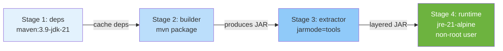

| Stage | Purpose |
|:------|:--------|
| **deps** | Pre-download Maven dependencies (separate layer = better cache hits) |
| **builder** | Compile + package Spring Boot JAR |
| **extractor** | Use `jarmode=tools` to split JAR into layers: dependencies, snapshot-dependencies, spring-boot-loader, application |
| **runtime** | Minimal JRE Alpine image, non-root user (`appuser`), container-aware JVM flags |

### 8.2 Frontend (3-Stage Build)

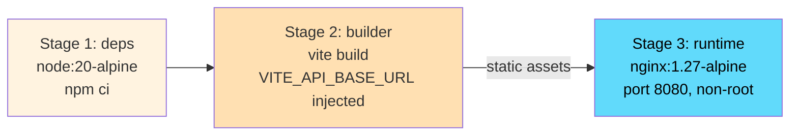

| Stage | Purpose |
|:------|:--------|
| **deps** | Run `npm ci --prefer-offline` to install dependencies once |
| **builder** | Run `npm run build` with `VITE_API_BASE_URL` as build arg → outputs static `dist/` |
| **runtime** | Copy `dist/` into nginx, run `apk upgrade --no-cache` to patch Alpine CVEs, listen on port 8080 as non-root |

---

## 9. CI/CD Pipeline

The application has **two independent pipelines** that only trigger when files in their respective directories change. Both pipelines share a deployment concurrency group to prevent simultaneous ECS updates that could exhaust the Fargate vCPU quota.

### 9.1 Pipeline Architecture

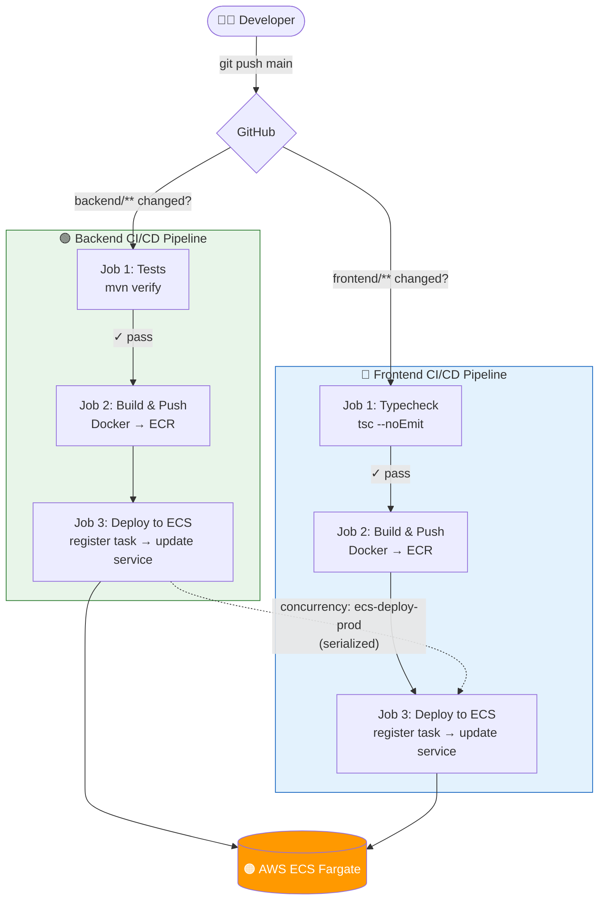

### 9.2 Authentication — GitHub OIDC → AWS

No long-lived AWS access keys are stored in GitHub. Each pipeline run uses **temporary credentials** obtained via OIDC federation:

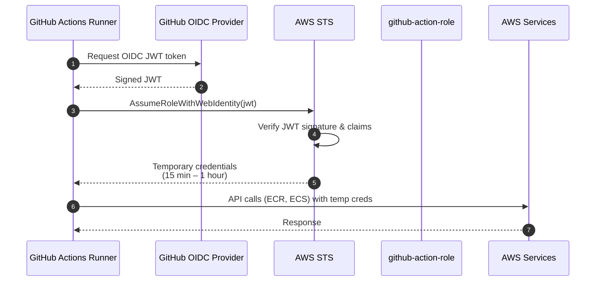

### 9.3 Pipeline Jobs (Detailed)

#### Backend Pipeline — `.github/workflows/backend-ci.yml`

| Job | Steps | Triggers |
|:----|:------|:---------|
| **1. Tests** | Checkout → Setup Java 21 → Maven cache → `mvn verify -B -q` → Upload surefire reports on failure | All push/PR to `backend/**` |
| **2. Build & Push** | Configure AWS OIDC → ECR login → Compute tags → Docker Buildx → Build multi-stage image → Push to ECR | `main` branch only |
| **3. Deploy** | Configure AWS OIDC → Download task definition → Strip read-only fields → Render new task definition with new image URI → Register revision → Update service → Wait for stability | `main` branch only |

#### Frontend Pipeline — `.github/workflows/frontend-ci.yml`

| Job | Steps | Triggers |
|:----|:------|:---------|
| **1. Typecheck** | Checkout → Setup Node 20 → npm cache → `npm ci` → `npm run typecheck` | All push/PR to `frontend/**` |
| **2. Build & Push** | Configure AWS OIDC → ECR login → Compute tags → Docker Buildx → Build with `VITE_API_BASE_URL` build arg → Push to ECR | `main` branch only |
| **3. Deploy** | Same as backend deploy job (with frontend service) | `main` branch only |

### 9.4 GitHub Secrets

| Secret Name | Purpose |
|:------------|:--------|
| `AWS_IAM_ROLE` | ARN of `github-action-role` to assume via OIDC |
| `ECS_CLUSTER` | ECS cluster name |
| `ECS_BACKEND_SERVICE` | Backend ECS service name |
| `ECS_FRONTEND_SERVICE` | Frontend ECS service name |
| `VITE_API_BASE_URL` | Full ALB URL + `/api/v1` (baked into frontend image at build time) |

---

## 10. IAM & Security

### 10.1 IAM Role Structure

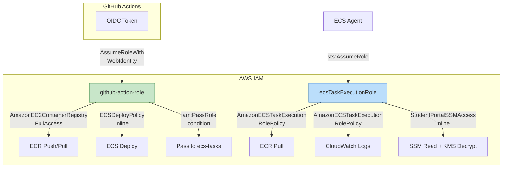

### 10.2 `github-action-role`

**Trust Policy** (who can assume this role):

```json
{
  "Version": "2012-10-17",
  "Statement": [
    {
      "Effect": "Allow",
      "Principal": {
        "Federated": "arn:aws:iam::697502032879:oidc-provider/token.actions.githubusercontent.com"
      },
      "Action": "sts:AssumeRoleWithWebIdentity",
      "Condition": {
        "StringEquals": {
          "token.actions.githubusercontent.com:aud": "sts.amazonaws.com"
        },
        "StringLike": {
          "token.actions.githubusercontent.com:sub": "repo:0019-KDU/aws-ecs-fullstack-deployment:*"
        }
      }
    }
  ]
}
```

**Permissions:**

| Policy | Type | Purpose |
|:-------|:----:|:--------|
| `AmazonEC2ContainerRegistryFullAccess` | AWS Managed | Push images to ECR |
| `ECSDeployPolicy` | Inline | Register task definitions, update ECS services |

**`ECSDeployPolicy` (inline):**

```json
{
  "Version": "2012-10-17",
  "Statement": [
    {
      "Effect": "Allow",
      "Action": [
        "ecs:RegisterTaskDefinition",
        "ecs:DescribeTaskDefinition",
        "ecs:UpdateService",
        "ecs:DescribeServices"
      ],
      "Resource": "*"
    },
    {
      "Effect": "Allow",
      "Action": "iam:PassRole",
      "Resource": "arn:aws:iam::697502032879:role/ecsTaskExecutionRole",
      "Condition": {
        "StringLike": {
          "iam:PassedToService": "ecs-tasks.amazonaws.com"
        }
      }
    }
  ]
}
```

### 10.3 `ecsTaskExecutionRole`

**Trust Policy** (who can assume this role):

```json
{
  "Version": "2012-10-17",
  "Statement": [
    {
      "Effect": "Allow",
      "Principal": { "Service": "ecs-tasks.amazonaws.com" },
      "Action": "sts:AssumeRole"
    }
  ]
}
```

**Permissions:**

| Policy | Type | Purpose |
|:-------|:----:|:--------|
| `AmazonECSTaskExecutionRolePolicy` | AWS Managed | Pull from ECR, write to CloudWatch Logs |
| `StudentPortalSSMAccess` | Inline | Read SSM parameters + decrypt with KMS |

**`StudentPortalSSMAccess` (inline):**

```json
{
  "Version": "2012-10-17",
  "Statement": [
    {
      "Effect": "Allow",
      "Action": ["ssm:GetParameters", "ssm:GetParameter"],
      "Resource": "arn:aws:ssm:ap-south-1:697502032879:parameter/student-portal/*"
    },
    {
      "Effect": "Allow",
      "Action": "kms:Decrypt",
      "Resource": "*"
    }
  ]
}
```

### 10.4 Security Best Practices Applied

| Concern | Solution |
|:--------|:---------|
| ❌ Long-lived AWS keys | ✅ GitHub OIDC → STS temporary credentials |
| ❌ Hardcoded DB passwords | ✅ SSM Parameter Store (SecureString + KMS encryption) |
| ❌ Running containers as root | ✅ Both images use dedicated non-root users |
| ❌ Public database | ✅ RDS in private subnet, no public IP |
| ❌ Public application servers | ✅ ECS tasks in private subnet, only ALB is public |
| ❌ Unpatched base image CVEs | ✅ `apk upgrade --no-cache` + pinned Tomcat version |
| ❌ Lost updates in concurrent edits | ✅ JPA optimistic locking via `@Version` |
| ❌ Schema drift | ✅ Flyway migrations + `ddl-auto: validate` |

---

## 11. Local Development

### 11.1 Prerequisites

| Tool | Version |
|:-----|:-------:|
| JDK | 21 |
| Maven | 3.9+ |
| Node.js | 20 LTS |
| Docker + Docker Compose | 24+ / v2 |

### 11.2 Run with Docker Compose (Recommended)

```bash
# 1. Copy environment template
cp .env.example .env

# 2. Edit .env with your DB password

# 3. Start the entire stack
docker compose up --build

# Access points:
#   Frontend → http://localhost
#   Backend  → http://localhost:8080
#   Swagger  → http://localhost:8080/swagger-ui.html
```

### 11.3 Run Each Tier Manually

<details>
<summary><b>1. Start MySQL</b></summary>

```bash
mysql -u root -p < database/01_create_database.sql
```
</details>

<details>
<summary><b>2. Start Spring Boot Backend</b></summary>

```bash
cd backend

export DB_URL="jdbc:mysql://localhost:3306/student_portal?useSSL=false&serverTimezone=UTC"
export DB_USERNAME=student_portal
export DB_PASSWORD=your_password

mvn spring-boot:run
# API listens on http://localhost:8080
```
</details>

<details>
<summary><b>3. Start React Frontend</b></summary>

```bash
cd frontend
npm install
npm run dev
# SPA listens on http://localhost:5173
# Vite proxies /api/* → http://localhost:8080
```
</details>

### 11.4 Environment Variables Reference

#### Backend (runtime)

| Variable | Default | Description |
|:---------|:--------|:------------|
| `DB_URL` | `jdbc:mysql://localhost:3306/student_portal?...` | JDBC connection string |
| `DB_USERNAME` | `root` | Database user |
| `DB_PASSWORD` | `root` | Database password |
| `SERVER_PORT` | `8080` | HTTP port |
| `CORS_ALLOWED_ORIGINS` | `http://localhost:5173` | Allowed CORS origins (comma-separated) |

#### Frontend (build-time only)

| Variable | Default | Description |
|:---------|:--------|:------------|
| `VITE_API_BASE_URL` | `/api/v1` | API base URL — baked in at `docker build` time |

> In production (ECS), `VITE_API_BASE_URL` is set to the full ALB URL via the GitHub Secret of the same name and is injected as a Docker build argument by the CI pipeline.

---

## 12. API Reference

**Base URL:** `http://<alb-dns>/api/v1`

### Endpoints

| Method | Endpoint | Description | Success Status |
|:------:|:---------|:------------|:--------------:|
| `GET` | `/students` | Paginated list with optional search | 200 |
| `GET` | `/students/{id}` | Get a single student | 200 |
| `POST` | `/students` | Create student | 201 + Location header |
| `PUT` | `/students/{id}` | Replace student | 200 |
| `DELETE` | `/students/{id}` | Delete student | 204 |
| `GET` | `/actuator/health` | Health check | 200 |
| `GET` | `/swagger-ui.html` | Interactive API explorer | 200 |

### Query Parameters — `GET /students`

| Parameter | Type | Default | Description |
|:----------|:----:|:-------:|:------------|
| `page` | `int` | `0` | Page number (0-based) |
| `size` | `int` | `10` | Items per page |
| `sort` | `string` | `lastName,asc` | `field,direction` |
| `search` | `string` | — | Searches `firstName`, `lastName`, `email` |

### Error Response Format (RFC 7807 — `application/problem+json`)

```json
{
  "type": "about:blank",
  "title": "Bad Request",
  "status": 400,
  "detail": "Validation failed",
  "timestamp": "2026-05-28T10:00:00Z",
  "errors": {
    "email": "Must be a valid email",
    "firstName": "First name is required"
  }
}
```

---

## 13. Project Structure

```
aws-ecs-fullstack-deployment/
│
├── .github/workflows/
│   ├── backend-ci.yml              # Backend CI/CD pipeline (3 jobs)
│   └── frontend-ci.yml             # Frontend CI/CD pipeline (3 jobs)
│
├── backend/                        # Spring Boot REST API
│   ├── src/main/java/com/studentportal/
│   │   ├── student/                # Entity, Repository, Service, Controller, DTOs
│   │   └── common/                 # GlobalExceptionHandler, ApiError
│   ├── src/main/resources/
│   │   ├── application.yml         # Spring Boot config (env-driven)
│   │   └── db/migration/           # Flyway SQL migrations
│   ├── Dockerfile                  # 4-stage layered build
│   └── pom.xml
│
├── frontend/                       # React 19 SPA
│   ├── src/
│   │   ├── api/                    # Axios instance + typed endpoints
│   │   ├── hooks/                  # TanStack Query hooks
│   │   ├── pages/                  # Page components (Students, Form, NotFound)
│   │   ├── App.tsx                 # Router + sidebar layout
│   │   └── styles.css              # Modern admin panel styling
│   ├── Dockerfile                  # 3-stage nginx build
│   ├── nginx.conf                  # SPA config, port 8080, /healthz
│   └── package.json
│
├── database/
│   └── 01_create_database.sql      # Initial DB + user bootstrap script
│
├── docs/                           # Architecture screenshots used in this README
│
├── docker-compose.yml              # Local dev stack (MySQL + backend + frontend)
└── README.md                       # You are here
```

---

<div align="center">

**Built with ❤️ for production-grade AWS deployments**

[Report a Bug](../../issues) · [Request a Feature](../../issues)

</div>
