# Student Portal — AWS ECS Fullstack Deployment

A production-grade three-tier Student Portal deployed on AWS ECS Fargate with a fully automated CI/CD pipeline using GitHub Actions and OIDC authentication.

---

## Table of Contents

- [Application Overview](#application-overview)
- [System Architecture](#system-architecture)
- [AWS Infrastructure Architecture](#aws-infrastructure-architecture)
- [VPC & Network Architecture](#vpc--network-architecture)
- [Request Flow](#request-flow)
- [Container Architecture](#container-architecture)
- [CI/CD Pipeline](#cicd-pipeline)
- [IAM Configuration](#iam-configuration)
- [AWS Services Used](#aws-services-used)
- [Local Development](#local-development)
- [Environment Variables](#environment-variables)
- [API Reference](#api-reference)
- [Security Considerations](#security-considerations)

---

## Application Overview

| Tier | Technology | Purpose |
|------|-----------|---------|
| **Frontend** | React 19 + TypeScript + Vite, nginx | SPA served via nginx on ECS Fargate |
| **Backend** | Spring Boot 3.4.5, Java 21 | REST API on ECS Fargate |
| **Database** | MySQL 8.4 | Managed RDS instance |

### Application Screenshots

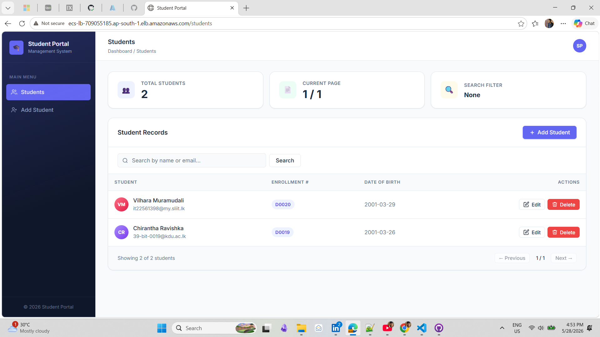
*Student list with search, pagination, and avatar initials*

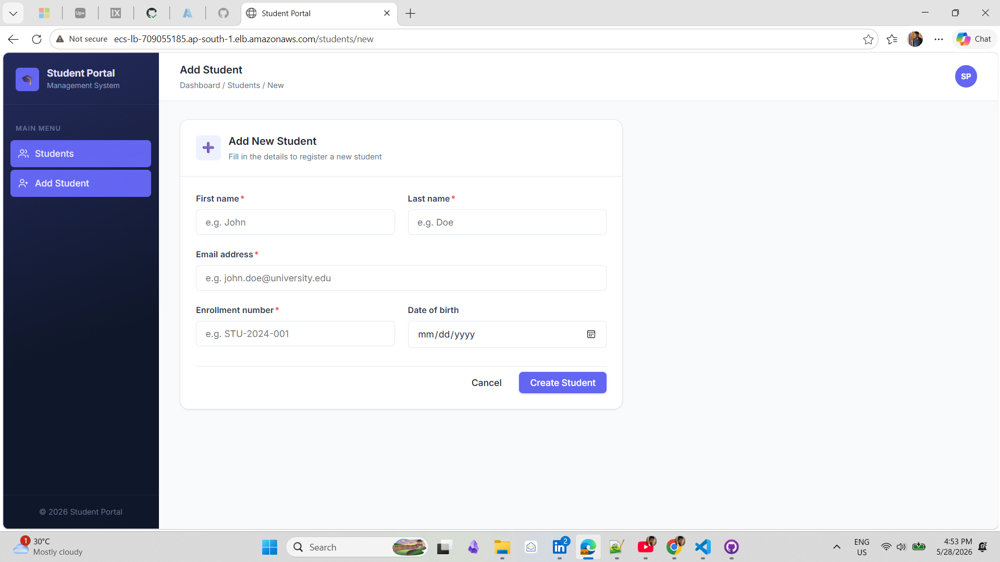
*Add / Edit student form with validation*

---

## System Architecture

```
┌─────────────────────────────────────────────────────────────────────┐
│                        AWS Cloud (ap-south-1)                        │
│                                                                       │
│   ┌─────────────┐     ┌──────────────────────────────────────────┐  │
│   │   Internet   │     │        VPC: project-ecs-vpc (10.0.0.0/16)│  │
│   │   Gateway    │     │                                          │  │
│   └──────┬──────┘     │  ┌─────────────┐  ┌─────────────────┐   │  │
│          │             │  │Public Subnet│  │  Public Subnet  │   │  │
│   ┌──────▼──────┐     │  │ap-south-1a  │  │  ap-south-1b    │   │  │
│   │             │     │  └──────┬──────┘  └────────┬────────┘   │  │
│   │  ALB        │─────┼─────────┴──────────────────┘            │  │
│   │ (port 80)   │     │                   │                      │  │
│   └──────┬──────┘     │          ┌────────▼─────────┐           │  │
│          │             │          │  ECS Fargate      │           │  │
│          │ /api/*      │          │  Cluster          │           │  │
│          ├─────────────┼─────────►│  ┌─────────────┐ │           │  │
│          │             │          │  │   Backend   │ │           │  │
│          │ /*          │          │  │  Container  │ │           │  │
│          ├─────────────┼─────────►│  │  (port 8080)│ │           │  │
│          │             │          │  └──────┬──────┘ │           │  │
│          │             │          │         │         │           │  │
│          │             │          │  ┌──────▼──────┐  │           │  │
│          │             │          │  │  Frontend   │  │           │  │
│          │             │          │  │  Container  │  │           │  │
│          │             │          │  │  (port 8080)│  │           │  │
│          │             │          │  └─────────────┘  │           │  │
│          │             │          └───────────────────┘           │  │
│          │             │                   │                      │  │
│          │             │  ┌────────────────▼──────────────────┐   │  │
│          │             │  │         Private Subnets            │   │  │
│          │             │  │  ┌──────────────────────────────┐  │   │  │
│          │             │  │  │   RDS MySQL 8.4 (port 3306)  │  │   │  │
│          │             │  │  └──────────────────────────────┘  │   │  │
│          │             │  └────────────────────────────────────┘   │  │
│          │             └──────────────────────────────────────────┘  │
└──────────┼──────────────────────────────────────────────────────────┘
           │
    ┌──────▼───────┐
    │   Browser    │
    └──────────────┘
```

---

## AWS Infrastructure Architecture

### Application Load Balancer

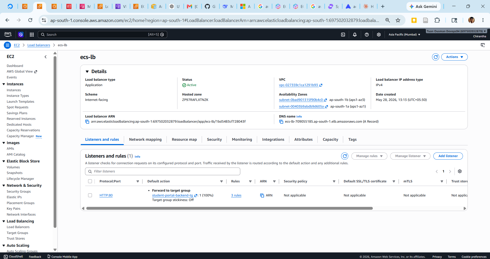

The ALB is the single entry point for all traffic. It is **internet-facing** and placed in **public subnets** across two availability zones.

**Listener Rules (HTTP:80):**

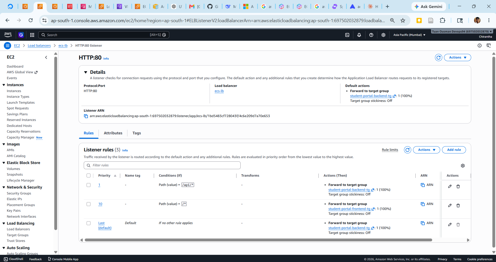

| Priority | Condition | Action | Target |
|----------|-----------|--------|--------|
| 1 | Path: `/api/*` | Forward | `student-portal-backend-tg` |
| 10 | Path: `/*` | Forward | `student-portal-frontend-tg` |
| Default | Any | Forward | `student-portal-backend-tg` |

**Target Groups:**

| Name | Port | Protocol | Health Check Path |
|------|------|----------|-------------------|
| `student-portal-backend-tg` | 8080 | HTTP | `/actuator/health` |
| `student-portal-frontend-tg` | 8080 | HTTP | `/healthz` |

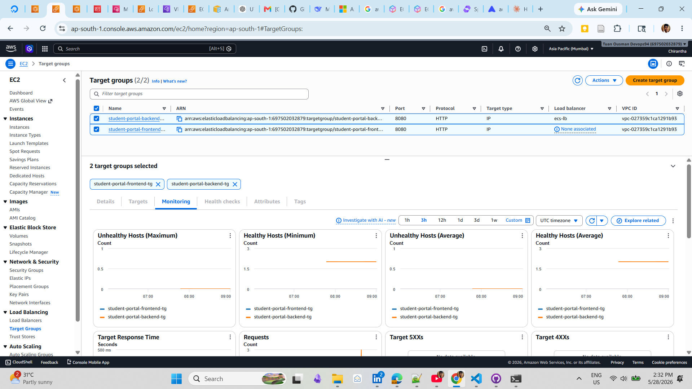

---

### ECS Cluster

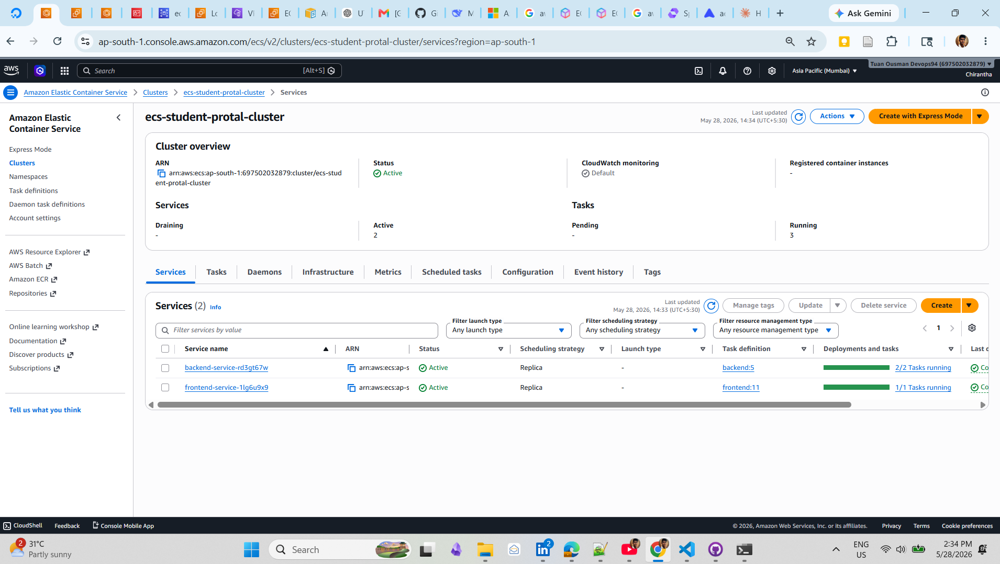

**Cluster:** `ecs-student-protal-cluster`  
**Launch type:** AWS Fargate (serverless containers — no EC2 to manage)

| Service | Task Definition | Desired Tasks | CPU | Memory |
|---------|----------------|---------------|-----|--------|
| `backend-service` | `backend` | 1 | 2 vCPU | 8 GB |
| `frontend-service` | `frontend` | 1 | 2 vCPU | 8 GB |

**ECS Task Definition:**

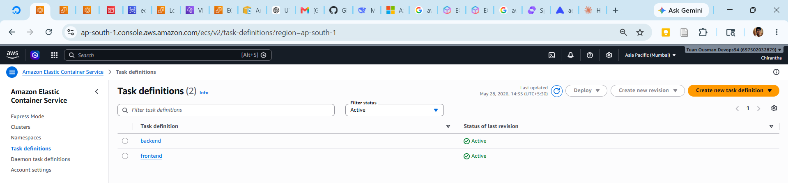

Each task definition contains:
- **Container image** — pulled from ECR at deploy time
- **Port mappings** — `8080:8080`
- **Secrets** — pulled from SSM Parameter Store at startup
- **Log configuration** — CloudWatch Logs (`awslogs` driver)
- **IAM roles** — `ecsTaskExecutionRole` for ECR pull + SSM read

---

### Amazon ECR

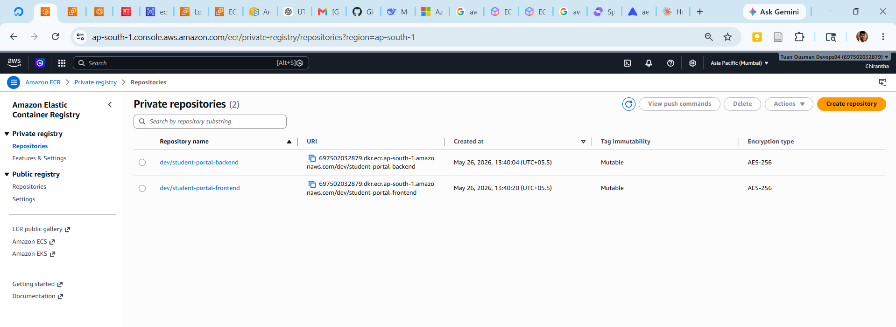

Two private ECR repositories:

| Repository | Image | Tag Strategy |
|------------|-------|-------------|
| `dev/student-portal-backend` | Spring Boot JAR in layered Docker image | `<git-sha>` + `latest` |
| `dev/student-portal-frontend` | React SPA served by nginx | `<git-sha>` + `latest` |

Images are tagged with the **first 8 characters of the Git SHA** for full traceability plus `latest` for the most recent main-branch build.

---

### Amazon RDS

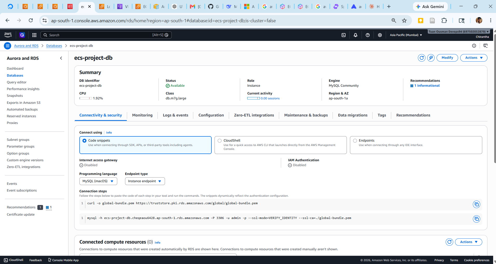

| Setting | Value |
|---------|-------|
| Engine | MySQL 8.4 Community |
| Instance class | db.m7g.large |
| Storage | 20 GiB gp3 (auto-scaling to 1 TB) |
| Subnets | Private subnets only |
| Publicly accessible | No |
| Encryption | Enabled (AWS managed KMS) |
| Multi-AZ | No (dev environment) |

**Schema management:** Flyway runs migrations automatically on Spring Boot startup.  
**Master username:** `admin` (stored in SSM, never in code).

---

### AWS Systems Manager Parameter Store

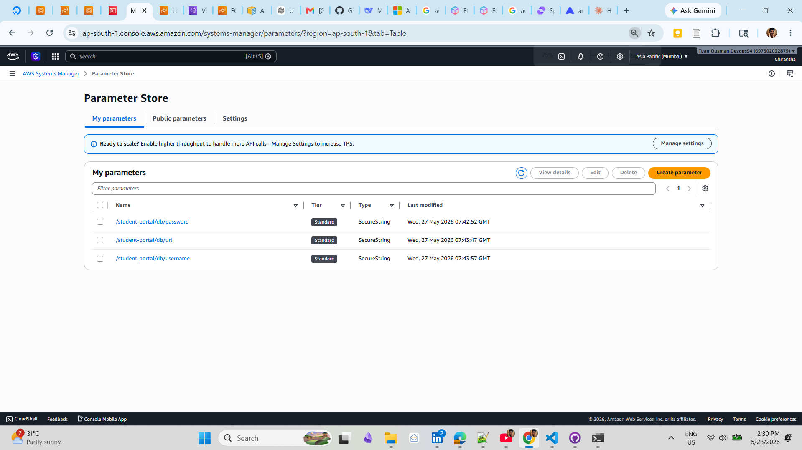

All secrets are stored in SSM Parameter Store. ECS injects them as environment variables before the container starts — the application code never calls SSM directly.

| Parameter | Type | Injected as |
|-----------|------|-------------|
| `/student-portal/db/url` | String | `DB_URL` |
| `/student-portal/db/username` | SecureString | `DB_USERNAME` |
| `/student-portal/db/password` | SecureString | `DB_PASSWORD` |

**SecureString** parameters are encrypted with `alias/aws/ssm` (AWS managed KMS key).

---

## VPC & Network Architecture

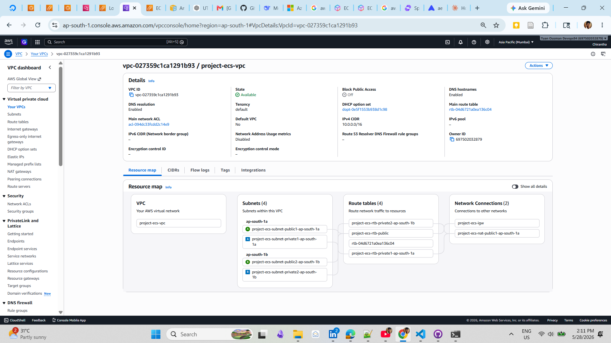

```
VPC: project-ecs-vpc (10.0.0.0/16)
│
├── Public Subnets (internet-accessible)
│   ├── project-ecs-subnet-public1-ap-south-1a
│   └── project-ecs-subnet-public2-ap-south-1b
│       └── Route table: 0.0.0.0/0 → Internet Gateway
│           Resources: ALB, NAT Gateway
│
├── Private Subnets (no direct internet access)
│   ├── project-ecs-subnet-private1-ap-south-1a
│   └── project-ecs-subnet-private2-ap-south-1b
│       └── Route table: 0.0.0.0/0 → NAT Gateway
│           Resources: ECS Tasks, RDS
│
├── Internet Gateway: project-ecs-igw
└── NAT Gateway: project-ecs-nat-public1-ap-south-1a
    └── Allows private resources to make outbound calls
        (e.g. ECS tasks pulling from ECR, calling SSM)
```

### Security Groups

| Security Group | Attached to | Inbound Rules |
|---------------|-------------|---------------|
| `default` (SG) | ALB, ECS Tasks | All traffic from itself + `0.0.0.0/0` |
| `ecs-rds-sg` | RDS | MySQL/3306 from default SG |

> **Production note:** In a real production setup, create dedicated SGs per resource with least-privilege rules (e.g., ALB SG allows 80/443 from internet; ECS SG allows 8080 only from ALB SG; RDS SG allows 3306 only from ECS SG).

---

## Request Flow

### Browser → Frontend (serving the React SPA)

```
Browser
  │  GET http://ecs-lb-xxx.ap-south-1.elb.amazonaws.com/
  │
  ▼
ALB (HTTP:80)
  │  Listener rule: priority 10, path /* → frontend target group
  │
  ▼
ECS Fargate — Frontend Task (nginx, port 8080)
  │  nginx serves /usr/share/nginx/html/index.html
  │  SPA fallback: try_files $uri $uri/ /index.html
  │
  ▼
Browser renders React app
```

### Browser → Backend (API calls)

```
Browser (React app)
  │  GET http://ecs-lb-xxx.ap-south-1.elb.amazonaws.com/api/v1/students
  │  (VITE_API_BASE_URL baked in at Docker build time)
  │
  ▼
ALB (HTTP:80)
  │  Listener rule: priority 1, path /api/* → backend target group
  │
  ▼
ECS Fargate — Backend Task (Spring Boot, port 8080)
  │  Controller → Service → Repository
  │
  ▼
RDS MySQL 8.4 (private subnet, port 3306)
  │  Flyway migrations + JPA queries
  │
  ▼
JSON response → ALB → Browser
```

### ECS Task Startup Sequence

```
ECS receives deploy request
  │
  ├─ Pull image from ECR (using ecsTaskExecutionRole)
  ├─ Read SSM parameters (DB_URL, DB_USERNAME, DB_PASSWORD)
  ├─ Inject as environment variables
  │
  ▼
Container starts
  │
  ├─ Backend: Spring Boot → Flyway migrations → HikariCP pool → Tomcat ready
  ├─ Frontend: nginx starts on port 8080, serves /healthz
  │
  ▼
ALB health check passes
  │  Backend:  GET /actuator/health → {"status":"UP"}
  │  Frontend: GET /healthz → 200 OK
  │
  ▼
Task registered as healthy in target group
Deployment completes ✓
```

---

## Container Architecture

### Backend Dockerfile (4-stage build)

```
Stage 1: deps (maven:3.9-eclipse-temurin-21-alpine)
  └── Download Maven dependencies (cached layer)

Stage 2: builder
  └── mvn package -DskipTests → produces JAR

Stage 3: extractor (spring-boot jarmode=tools)
  └── Extracts layered JAR for optimal Docker caching:
      dependencies/ snapshot-dependencies/ spring-boot-loader/ application/

Stage 4: runtime (eclipse-temurin:21-jre-alpine)
  └── Non-root user (appuser)
  └── JAVA_TOOL_OPTIONS with container-aware JVM flags
  └── EXPOSE 8080
```

### Frontend Dockerfile (3-stage build)

```
Stage 1: deps (node:20-alpine)
  └── npm ci --prefer-offline (cached layer)

Stage 2: builder
  └── VITE_API_BASE_URL injected as build arg
  └── npm run build → outputs /app/dist

Stage 3: runtime (nginx:1.27-alpine)
  └── apk upgrade --no-cache (fixes Alpine CVEs)
  └── Custom nginx.conf (port 8080, SPA fallback, /healthz)
  └── Non-root user (nginx)
  └── EXPOSE 8080
```

### Docker Compose (local development)

```yaml
Services:
  db       → MySQL 8.4 (host port 3307 to avoid conflicts)
  backend  → Spring Boot (port 8080)
  frontend → nginx SPA (port 80)

Networks:
  backend_net  → db ↔ backend only (MySQL never exposed to frontend)
  frontend_net → backend ↔ frontend

Volumes:
  db_data → persistent MySQL data
```

---

## CI/CD Pipeline

### Architecture

```
Developer pushes to main
        │
        ├──► backend/** changed?
        │       └── Backend CI Pipeline
        │
        └──► frontend/** changed?
                └── Frontend CI Pipeline

Both pipelines share concurrency group "ecs-deploy-prod"
→ They queue, never run deploy steps simultaneously
  (prevents vCPU quota exhaustion during rolling updates)
```

### Authentication — GitHub OIDC → AWS

No long-lived access keys are stored. GitHub proves its identity cryptographically:

```
GitHub Actions runner
  │  Generates short-lived OIDC JWT token
  │
  ▼
AWS STS: AssumeRoleWithWebIdentity
  │  Verifies JWT against GitHub's OIDC provider
  │  Returns temporary credentials (expire in 1 hour)
  │
  ▼
github-action-role (IAM Role)
  │  ECR push permissions
  │  ECS deploy permissions
  │  SSM read permissions (for task registration)
```

### Backend Pipeline (`.github/workflows/backend-ci.yml`)

```
Trigger: push/PR to main when backend/** or workflow file changes

Job 1 — Unit & Integration Tests
  ├── Checkout
  ├── Setup Java 21 (Temurin) + Maven cache
  ├── mvn verify -B -q
  └── Upload surefire reports on failure (artifact)

Job 2 — Docker Build & Push  [needs: Job 1]
  ├── Configure AWS credentials (OIDC)
  ├── Login to ECR
  ├── Compute image tags (SHORT_SHA + latest)
  ├── Setup Docker Buildx
  ├── Build multi-stage image + push to ECR
  └── Write GitHub Step Summary

Job 3 — Deploy to ECS  [needs: Job 2, main branch only]
  [concurrency: ecs-deploy-prod — queues behind frontend deploy]
  ├── Configure AWS credentials (OIDC)
  ├── Download current task definition JSON
  ├── Strip read-only fields (jq)
  ├── Render new task definition with updated image URI
  ├── Register new task definition revision
  └── Update ECS service + wait for stability
```

### Frontend Pipeline (`.github/workflows/frontend-ci.yml`)

```
Trigger: push/PR to main when frontend/** or workflow file changes

Job 1 — Lint & Type Check
  ├── Checkout
  ├── Setup Node 20 + npm cache
  ├── npm ci --prefer-offline
  └── npm run typecheck (tsc --noEmit)

Job 2 — Docker Build & Push  [needs: Job 1]
  ├── Configure AWS credentials (OIDC)
  ├── Login to ECR
  ├── Compute image tags (SHORT_SHA + latest)
  ├── Setup Docker Buildx
  ├── Build image with VITE_API_BASE_URL build arg (from GitHub secret)
  ├── Push to ECR
  └── Write GitHub Step Summary

Job 3 — Deploy to ECS  [needs: Job 2, main branch only]
  [concurrency: ecs-deploy-prod — queues behind backend deploy]
  ├── Configure AWS credentials (OIDC)
  ├── Download current task definition JSON
  ├── Strip read-only fields (jq)
  ├── Render new task definition with updated image URI
  ├── Register new task definition revision
  └── Update ECS service + wait for stability
```

### GitHub Secrets Required

| Secret | Description |
|--------|-------------|
| `AWS_IAM_ROLE` | ARN of `github-action-role` (OIDC assumed role) |
| `ECS_CLUSTER` | ECS cluster name |
| `ECS_BACKEND_SERVICE` | Backend ECS service name |
| `ECS_FRONTEND_SERVICE` | Frontend ECS service name |
| `VITE_API_BASE_URL` | Full ALB URL + `/api/v1` (baked into frontend image) |

---

## IAM Configuration

### github-action-role

**Trust Policy** — allows GitHub Actions to assume this role via OIDC:

```json
{
  "Version": "2012-10-17",
  "Statement": [
    {
      "Effect": "Allow",
      "Principal": {
        "Federated": "arn:aws:iam::697502032879:oidc-provider/token.actions.githubusercontent.com"
      },
      "Action": "sts:AssumeRoleWithWebIdentity",
      "Condition": {
        "StringEquals": {
          "token.actions.githubusercontent.com:aud": "sts.amazonaws.com"
        },
        "StringLike": {
          "token.actions.githubusercontent.com:sub": "repo:0019-KDU/aws-ecs-fullstack-deployment:*"
        }
      }
    }
  ]
}
```

**Attached Policies:**

| Policy | Type | Purpose |
|--------|------|---------|
| `AmazonEC2ContainerRegistryFullAccess` | AWS Managed | Push images to ECR |
| `ECSDeployPolicy` | Inline | Register task definitions, update services |

**ECSDeployPolicy (inline):**

```json
{
  "Version": "2012-10-17",
  "Statement": [
    {
      "Effect": "Allow",
      "Action": [
        "ecs:RegisterTaskDefinition",
        "ecs:DescribeTaskDefinition",
        "ecs:UpdateService",
        "ecs:DescribeServices"
      ],
      "Resource": "*"
    },
    {
      "Effect": "Allow",
      "Action": "iam:PassRole",
      "Resource": "arn:aws:iam::697502032879:role/ecsTaskExecutionRole",
      "Condition": {
        "StringLike": {
          "iam:PassedToService": "ecs-tasks.amazonaws.com"
        }
      }
    }
  ]
}
```

---

### ecsTaskExecutionRole

**Trust Policy** — allows ECS Tasks to assume this role:

```json
{
  "Version": "2012-10-17",
  "Statement": [
    {
      "Effect": "Allow",
      "Principal": {
        "Service": "ecs-tasks.amazonaws.com"
      },
      "Action": "sts:AssumeRole"
    }
  ]
}
```

**Attached Policies:**

| Policy | Type | Purpose |
|--------|------|---------|
| `AmazonECSTaskExecutionRolePolicy` | AWS Managed | Pull images from ECR, write to CloudWatch Logs |
| `StudentPortalSSMAccess` | Inline | Read SSM parameters at task startup |

**StudentPortalSSMAccess (inline):**

```json
{
  "Version": "2012-10-17",
  "Statement": [
    {
      "Effect": "Allow",
      "Action": ["ssm:GetParameters", "ssm:GetParameter"],
      "Resource": "arn:aws:ssm:ap-south-1:697502032879:parameter/student-portal/*"
    },
    {
      "Effect": "Allow",
      "Action": "kms:Decrypt",
      "Resource": "*"
    }
  ]
}
```

---

## AWS Services Used

| Service | Usage |
|---------|-------|
| **ECS Fargate** | Runs backend and frontend containers (serverless) |
| **ECR** | Private Docker image registry |
| **RDS MySQL 8.4** | Managed relational database |
| **ALB** | Load balancing + path-based routing |
| **VPC** | Network isolation with public/private subnets |
| **SSM Parameter Store** | Secrets management (DB credentials) |
| **CloudWatch Logs** | Container log aggregation |
| **IAM** | OIDC federation + least-privilege roles |
| **STS** | Temporary credential issuance for GitHub OIDC |
| **KMS** | Encryption of SecureString parameters |

---

## Local Development

### Prerequisites

| Tool | Version |
|------|---------|
| JDK | 21 |
| Maven | 3.9+ |
| Node.js | 20 LTS |
| npm | 10+ |
| Docker | 24+ |
| Docker Compose | v2 |

### Quick Start (Docker Compose)

```bash
# Copy and fill in your passwords
cp .env.example .env

# Start all three services
docker compose up --build

# Access:
# Frontend: http://localhost:80
# Backend API: http://localhost:8080
# Swagger UI: http://localhost:8080/swagger-ui.html
```

### Manual Start

**1. Database**
```bash
mysql -u root -p < database/01_create_database.sql
```

**2. Backend**
```bash
cd backend
export DB_URL=jdbc:mysql://localhost:3306/student_portal?useSSL=false&serverTimezone=UTC
export DB_USERNAME=student_portal
export DB_PASSWORD=your_password
mvn spring-boot:run
# API at http://localhost:8080
```

**3. Frontend**
```bash
cd frontend
npm install
npm run dev
# SPA at http://localhost:5173 (proxies /api/* to localhost:8080)
```

---

## Environment Variables

### Backend

| Variable | Default | Description |
|----------|---------|-------------|
| `DB_URL` | `jdbc:mysql://localhost:3306/student_portal?...` | JDBC connection URL |
| `DB_USERNAME` | `root` | Database username |
| `DB_PASSWORD` | `12345@dev` | Database password |
| `SERVER_PORT` | `8080` | HTTP port |
| `CORS_ALLOWED_ORIGINS` | `http://localhost:5173` | Allowed CORS origins |

### Frontend (build-time)

| Variable | Default | Description |
|----------|---------|-------------|
| `VITE_API_BASE_URL` | `/api/v1` | Base URL for all API calls (baked in at `docker build`) |

In ECS, `VITE_API_BASE_URL` is set to the full ALB URL (e.g., `http://ecs-lb-xxx.ap-south-1.elb.amazonaws.com/api/v1`) via the `VITE_API_BASE_URL` GitHub Secret and injected at image build time by the CI pipeline.

---

## API Reference

**Base URL:** `http://<alb-dns>/api/v1`

| Method | Endpoint | Description | Success |
|--------|----------|-------------|---------|
| `GET` | `/students` | Paginated list with optional search | 200 |
| `GET` | `/students/{id}` | Get one student | 200 |
| `POST` | `/students` | Create student | 201 + Location header |
| `PUT` | `/students/{id}` | Full update | 200 |
| `DELETE` | `/students/{id}` | Delete | 204 |
| `GET` | `/actuator/health` | Health probe | 200 |
| `GET` | `/swagger-ui.html` | Interactive API docs | 200 |

**Query parameters for `GET /students`:**

| Parameter | Type | Description |
|-----------|------|-------------|
| `page` | int | Page number (0-based, default 0) |
| `size` | int | Page size (default 10) |
| `sort` | string | e.g. `lastName,asc` |
| `search` | string | Searches firstName, lastName, email |

**Error format (RFC 7807):**

```json
{
  "type": "about:blank",
  "title": "Bad Request",
  "status": 400,
  "detail": "Validation failed",
  "timestamp": "2026-05-28T10:00:00Z",
  "errors": {
    "email": "Must be a valid email",
    "firstName": "First name is required"
  }
}
```

---

## Security Considerations

| Area | Implementation |
|------|---------------|
| **No static AWS keys** | GitHub OIDC generates temporary credentials per run |
| **No secrets in code** | DB credentials in SSM Parameter Store (SecureString) |
| **Non-root containers** | Both backend (`appuser`) and frontend (`nginx` user) run as non-root |
| **Private database** | RDS in private subnet, not publicly accessible |
| **Private ECS tasks** | ECS tasks in private subnet, only ALB is public |
| **Encrypted secrets** | SSM SecureString encrypted with KMS |
| **Image CVE patching** | Backend: Tomcat pinned to latest; Frontend: `apk upgrade --no-cache` |
| **Network isolation** | Separate public/private subnets; ECS cannot be reached directly |
| **Optimistic locking** | `@Version` on Student entity prevents lost updates |

---

## Project Structure

```
aws-ecs-fullstack-deployment/
├── .github/
│   └── workflows/
│       ├── backend-ci.yml       CI/CD pipeline for Spring Boot
│       └── frontend-ci.yml      CI/CD pipeline for React
├── backend/
│   ├── src/
│   │   ├── main/java/com/studentportal/
│   │   │   ├── student/         Controller, Service, Repository, DTOs
│   │   │   └── common/          GlobalExceptionHandler, ApiError
│   │   └── main/resources/
│   │       ├── application.yml
│   │       └── db/migration/    Flyway SQL migrations
│   ├── Dockerfile               4-stage layered build
│   └── pom.xml
├── frontend/
│   ├── src/
│   │   ├── api/                 Axios instance + typed endpoints
│   │   ├── hooks/               TanStack Query hooks
│   │   └── pages/               StudentsPage, StudentFormPage, NotFoundPage
│   ├── Dockerfile               3-stage nginx build
│   ├── nginx.conf               SPA config, port 8080, /healthz
│   └── package.json
├── database/
│   └── 01_create_database.sql   One-time DB + user bootstrap
├── docs/                        Architecture screenshots
├── docker-compose.yml           Local development stack
└── README.md
```
